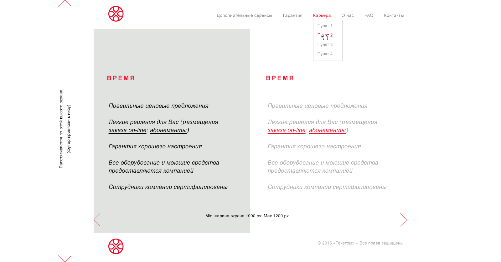

## Реализация макета 

The following things need to be taken into account:

- Minimum content width 1000px
- Maximum content width 1200px
- The background of the central part is stretched across the entire height of the screen
- The footer is anchored to the bottom of the screen if the content does not reach the end of the page, otherwise the footer goes beyond the browser window and a scrollbar appears.
- Menu items change color when you hover over them
- We do not welcome the use of frameworks and assemblers in layout, the maximum is the use of jQuery and lightweight plugins for it
- Minimum use of js is desirable